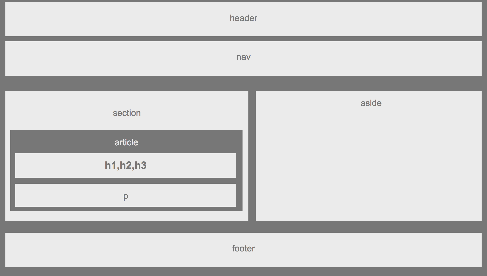

# Wireframe

Learning html, css, floats, positioning, box model 

# Link to deployed site

[hw-wireframe](https://mawais54013.github.io/Wireframe/)

# Images


# Technology used
- HTML
- CSS

# Code Snippets

```
<body>
        <header>header</header>   
        <nav>nav</nav>

        <section>section<article>article<h1>h1,h2,h3</h1><p>p</p></article></section>
        <aside><p>aside</p></aside>
</body>
```
# Author
[Muhammad Awais](https://github.com/mawais54013/HW-Wireframe)
